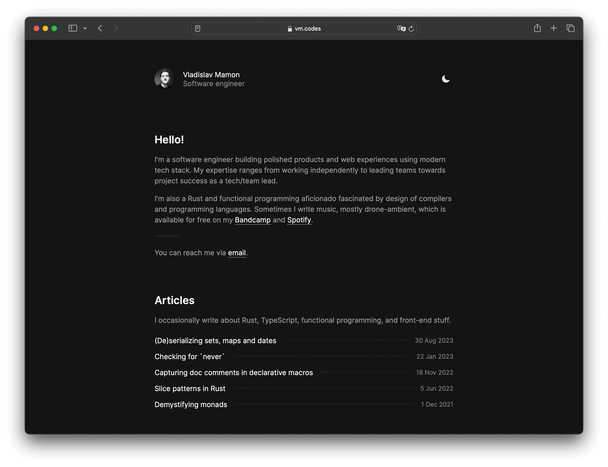

# vm.codes

Personal website &amp; blog.

## Features

- [x] Built with **[Astro 4][astro]** and **TypeScript**.
- [x] Uses **Astro [Content Collections][collections]** with **[Zod]** schemas.
- [x] Uses good old Markdown with YAML frontmatter for authoring articles.
- [x] Uses **[Expressive Code][expressive]** for syntax highlighting.
- [x] Ships ~5-7 KB (gzipped) of JS to support [View Transitions][vts] and theme switching. Also works with JS disabled.
- [x] **Dark theme** (respects `prefers-color-scheme`) support.
- [x] Uses **[Tailwind]** for styling.
- [x] **[Open Graph][open-graph]** support.

Also, well, not a feature, but... **99/100 on [yellowlab.tools]** and **all 100s on [pagespeed.web.dev]**.

## Backlog

- [ ] Add dynamic Open Graph image generation.
- [ ] Add article series.

## License

> **The content under the `src/content` directory is [licensed](LICENSE-CONTENT) under the [CC BY 4.0][cc-by-license] license.**

The code is licensed under the [MIT](LICENSE) license.

[astro]: https://astro.build
[tailwind]: https://tailwindcss.com
[expressive]: https://expressive-code.com
[open-graph]: https://ogp.me
[cc-by-license]: https://choosealicense.com/licenses/cc-by-4.0/
[yellowlab.tools]: https://yellowlab.tools/result/gk7b2fdj0y
[pagespeed.web.dev]: https://pagespeed.web.dev/analysis/https-vm-codes/0m52xtvgee?form_factor=mobile
[collections]: https://docs.astro.build/en/guides/content-collections/
[zod]: https://zod.dev
[vts]: https://docs.astro.build/en/guides/view-transitions/
