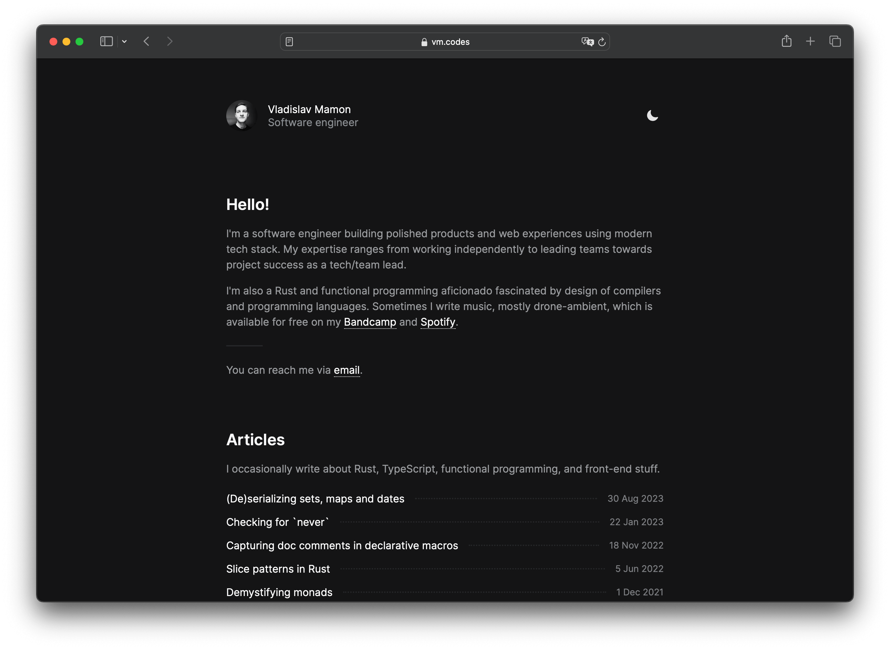
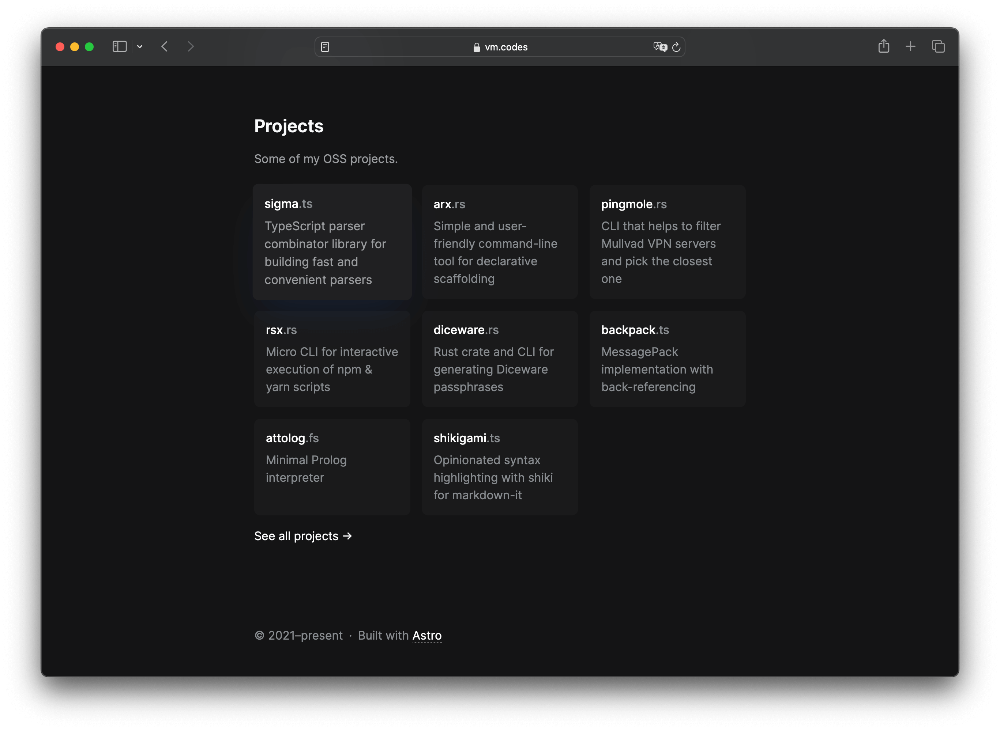
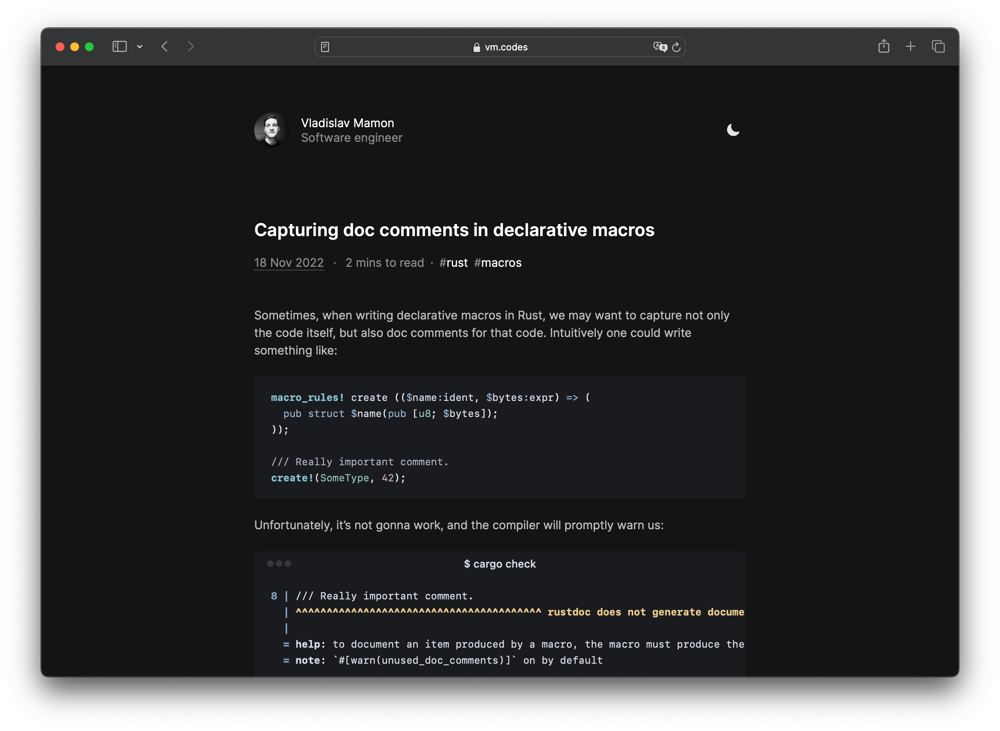

# nrsk.dev

Personal website &amp; blog.

  

## Features

- [x] Built with **[Astro 4][astro]** and **TypeScript**.
- [x] Uses **Astro [Content Collections][collections]** with **[Zod]** schemas.
- [x] Uses **Markdown**/**MDX** with YAML frontmatter for authoring articles.
- [x] Uses **[Expressive Code][expressive]** for syntax highlighting.
- [x] Ships ~1-2 KB of JS to support and theme switching.
- [x] **Dark theme** (respects `prefers-color-scheme`) support.
- [x] Uses **[Tailwind]** for styling.
- [x] Uses **[astro-seo]** to generate **[Open Graph][open-graph]** metadata.
- [x] Uses **[satori]** to generate static **[Open Graph images][open-graph-images]**.

Also:

- [x] Scores **99/100 on [yellowlab.tools]** (all devices).
- [x] Scores **all 100s on [pagespeed.web.dev]** (both mobile and desktop).

## License

> **The content under the `src/content` directory is [licensed](LICENSE-CONTENT) under the [CC BY 4.0][cc-by-license] license.**

The code is licensed under the [MIT](LICENSE) license.

<!-- Links. -->

[astro]: https://astro.build
[tailwind]: https://tailwindcss.com
[expressive]: https://expressive-code.com
[open-graph]: https://ogp.me
[open-graph-images]: https://ogp.me/#structured
[cc-by-license]: https://choosealicense.com/licenses/cc-by-4.0/
[collections]: https://docs.astro.build/en/guides/content-collections/
[zod]: https://zod.dev
[astro-seo]: https://github.com/jonasmerlin/astro-seo
[satori]: https://github.com/vercel/satori

<!-- Perf links. -->

[yellowlab.tools]: https://yellowlab.tools/result/guytxvkjwf
[pagespeed.web.dev]: https://pagespeed.web.dev/analysis/https-vm-codes/o6sb2m6idv?form_factor=mobile
